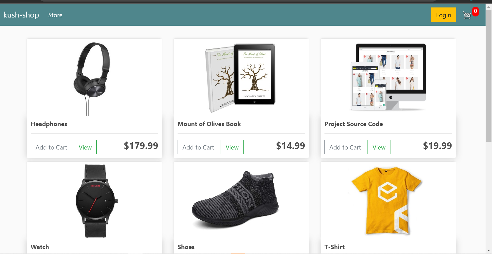
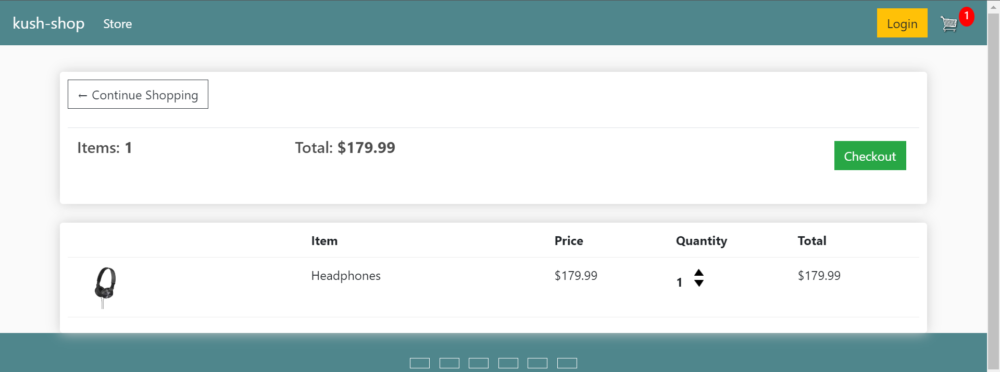
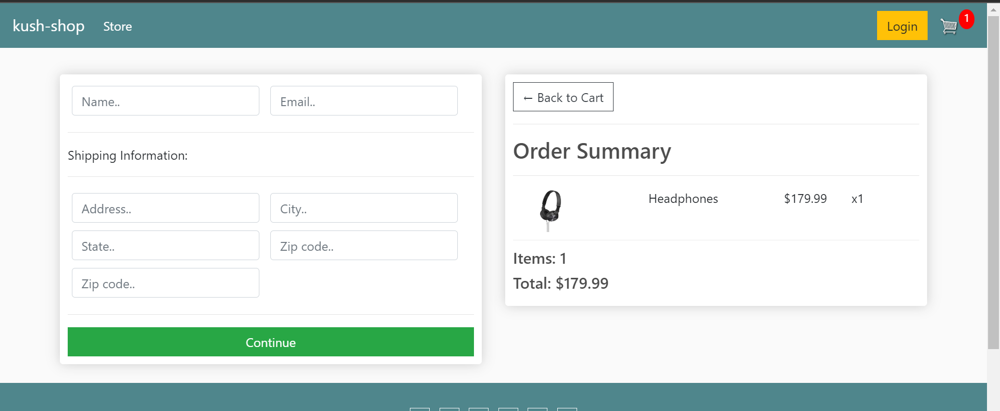

# README
<!--
This README would normally document whatever steps are necessary to get the
application up and running.

Things you may want to c<!--
*** Thanks for checking out this README Template. If you have a suggestion that would
*** make this better, please fork the repo and create a pull request or simply open
*** an issue with the tag "enhancement".
*** Thanks again! Now go create something AMAZING! :D
-->

<!-- PROJECT SHIELDS -->
<!--
*** I'm using markdown "reference style" links for readability.
*** Reference links are enclosed in brackets [ ] instead of parentheses ( ).
*** See the bottom of this document for the declaration of the reference variables
*** for contributors-url, forks-url, etc. This is an optional, concise syntax you may use.
*** https://www.markdownguide.org/basic-syntax/#reference-style-links
-->
[![Contributors][contributors-shield]][contributors-url] 
[![Forks][forks-shield]][forks-url] 
[![Stargazers][stars-shield]][stars-url] 
[![Issues][issues-shield]][issues-url] 
 

# eCommerce Website - Django

>  eCommerce website built with Django. Logged and non-logged users can add items to the cart, fill up the shipment form and get ready to receive their shopping list.

Landing page:


Cart page:


Payment page:


Additional description about the project and its features.

## Built With

- HTML 
- CSS
- BOOTSTRAP
- DJANGO
- GITHUB ACTIONS
- VSCODE

## Getting Started
### Usage
To have this app on your pc, you need to:
* [download](https://github.com/Meserat/django-ecommerce/archive/refs/heads/main.zip) or clone this repo:
  - Clone with SSH:
  ```
    https://github.com/Meserat/django-ecommerce.git
  ```
  - Clone with HTTPS
  ```
   https://github.com/Meserat/django-ecommerce.git
  ```

## Author

👤 Meserat Edessa 
- Github: [@meserat](https://github.com/meserat) 
- Linkedin: [Meserat Edessa](https://www.linkedin.com/in/meserat-edessa-2494421ba/) 

## 🤝 Contributing

Contributions, issues and feature requests are welcome!


## Show your support

Give a ⭐️ if you like this project!

## Acknowledgments 🚀

- Django Docs
- [Dennis Ivy](https://twitter.com/dennisivy11)

## 📝 License

This project is [MIT](lic.url) licensed.

<!-- MARKDOWN LINKS & IMAGES -->
<!-- https://www.markdownguide.org/basic-syntax/#reference-style-links -->
[contributors-shield]: https://img.shields.io/github/contributors/javitocor/eCommerce-Site-Django.svg?style=flat-square
[contributors-url]: https://github.com/javitocor/eCommerce-Site-Django/graphs/contributors
[forks-shield]: https://img.shields.io/github/forks/javitocor/eCommerce-Site-Django.svg?style=flat-square
[forks-url]: https://github.com/javitocor/eCommerce-Site-Django/network/members
[stars-shield]: https://img.shields.io/github/stars/javitocor/eCommerce-Site-Django.svg?style=flat-square
[stars-url]: https://github.com/javitocor/eCommerce-Site-Django/stargazers
[issues-shield]: https://img.shields.io/github/issues/javitocor/eCommerce-Site-Django.svg?style=flat-square
[issues-url]: https://github.com/javitocor/eCommerce-Site-Django/issuesover:
